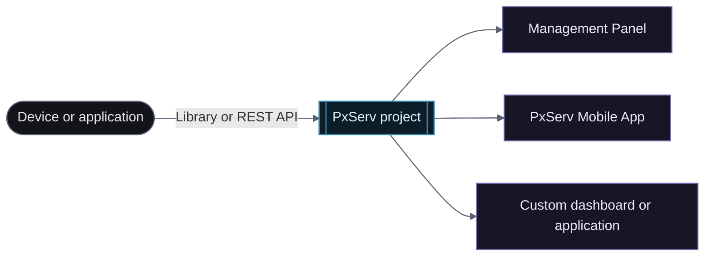

# Quick Start

PxServ is an IoT platform that provides API and library support for connecting software and hardware projects to the cloud. It is compatible with Arduino, JavaScript/TypeScript, Rust, ESP32, ESP8266, Raspberry Pi, and any internet-capable device.

## Your first data flow

Sensor data sent with the Arduino Library is available from the Management Panel, PxServ Mobile App, and custom applications.

<div className="docs-mermaid">



</div>

## Steps

### 1. Create a Project

Sign in to the PxServ platform and create a new project. You will receive a project API key used to authenticate all requests.

### 2. Choose Your Integration

PxServ supports the following integrations:

* [Arduino Library](/en/arduino-library/)
* [JavaScript / TypeScript Library](/en/javascript-typescript-library/)
* [Rust Library](/en/rust-library/)
* [REST API](/en/rest-api/)
* [Real-Time Connection (Socket.IO)](/en/realtime-connection/)
* [OTA Feature](/en/ota-feature/)

### 3. Send Data to PxServ

The following example uses the Arduino Library with an ESP32 and a DHT11 sensor to send temperature and humidity data to PxServ:

```cpp
#include <PxServ.h>
#include "DHT.h"

#define DHT_PIN 4
#define DHT_TYPE DHT11

PxServ client("your_pxserv_api_key");
DHT dht(DHT_PIN, DHT_TYPE);

void setup() {
  Serial.begin(115200);
  PxServ::connectWifi("your_wifi_ssid", "your_wifi_password");
  dht.begin();
}

void loop() {
  float temperature = dht.readTemperature();
  float humidity = dht.readHumidity();

  if (isnan(temperature) || isnan(humidity)) {
    Serial.println("Failed to read from DHT11 sensor.");
    return;
  }

  client.setData("temperature", String(temperature));
  client.setData("humidity", String(humidity));
}
```

### 4. Manage Your Data

Once data is flowing, you can:

* Analyze data with AI-powered insights from the management panel
* View historical data on the statistics page
* Browse and manage stored records from the database page

<div className="docs-image-grid">


</div>

### 5. Access Data Anywhere

Retrieve and manage your data through:

* PxServ Management Panel
* [PxServ Mobile App](https://play.google.com/store/apps/details?id=net.pxserv.mobile)
* Custom dashboards or applications built with the PxServ API
