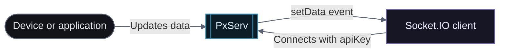

# Real-Time Connection (Socket.IO)

PxServ supports real-time bidirectional communication via **Socket.IO**. Authenticate using your project API key and listen for data events as they occur.

The examples below use JavaScript/TypeScript. The same event structure and API key authentication apply to any language with a Socket.IO client (Python, Rust, Go, Java, etc.).

## Event flow

The client authenticates once; subsequent data events are delivered over the same connection.

<div className="docs-mermaid">



</div>

## Connecting

```js
const socket = io("https://api.pxserv.net", {
  auth: {
    apiKey: "your_project_api_key",
  },
});

socket.on("connect", () => {
  console.log("Connected to PxServ.");
});
```

## Events

### `setData` — Data Updated

Emitted when a key-value pair is saved or updated.

```js
socket.on("setData", (data) => {
  console.log("Data updated:", data);
});
```

**Example payload:**

```json
{ "key": "temperature", "lastUpdate": "2025-03-31T17:40:19.653Z", "icon": "hum", "value": "64.11" }
```

***

### `removeData` — Data Removed

Emitted when a key is deleted.

```js
socket.on("removeData", (data) => {
  console.log("Data removed:", data);
});
```

**Example payload:**

```json
{ "key": "temperature" }
```

***

## Disconnecting

```js
socket.disconnect();
```

## Other Languages

| Language | Socket.IO Client |
| -------- | ---------------- |
| JavaScript / TypeScript | [socket.io-client](https://socket.io/docs/v4/client-initialization/) |
| Python | [python-socketio](https://python-socketio.readthedocs.io/en/latest/client.html) |
| Rust | [rust-socketio](https://github.com/1c3t3a/rust-socketio) |
| Go | [go-socket.io](https://github.com/googollee/go-socket.io) |
