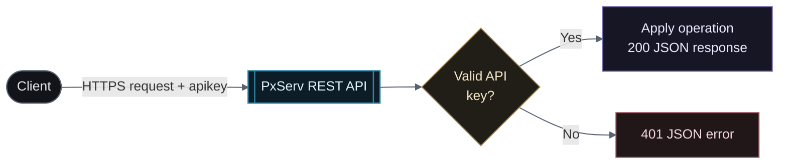

# REST API

Choose the service below to manage PxServ data over HTTP.

  <a className="api-service-card" href="/en/rest-api/database/">
    DB
    <strong>Database API</strong><small>Store, retrieve, change, and remove project data</small>
    <b>→</b>
  </a>

## Request lifecycle

Every request is authenticated with the project API key and returns a consistent JSON response.

