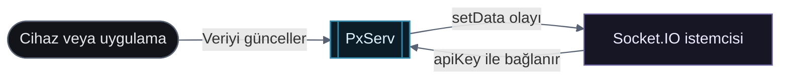

# Gerçek Zamanlı Bağlantı (Socket.IO)

PxServ, **Socket.IO** aracılığıyla gerçek zamanlı çift yönlü iletişimi destekler. Proje API anahtarınızla kimlik doğrulaması yapın ve veri olaylarını anında dinleyin.

Aşağıdaki örnekler JavaScript/TypeScript kullanmaktadır. Aynı olay yapısı ve API anahtarı kimlik doğrulaması, Socket.IO istemcisi olan tüm dillerde (Python, Rust, Go, Java vb.) geçerlidir.

## Olay akışı

İstemci bir kez kimlik doğrular; sonraki veri olayları aynı bağlantı üzerinden yayınlanır.

<div className="docs-mermaid">



</div>

## Bağlantı

```js
const socket = io("https://api.pxserv.net", {
  auth: {
    apiKey: "proje_api_anahtariniz",
  },
});

socket.on("connect", () => {
  console.log("PxServ'e bağlandı.");
});
```

## Olaylar

### `setData` — Veri Güncellendi

Bir anahtar-değer çifti kaydedildiğinde veya güncellendiğinde tetiklenir.

```js
socket.on("setData", (data) => {
  console.log("Veri güncellendi:", data);
});
```

**Örnek veri:**

```json
{ "key": "sıcaklık", "lastUpdate": "2025-03-31T17:40:19.653Z", "icon": "hum", "value": "64.11" }
```

***

### `removeData` — Veri Silindi

Bir anahtar silindiğinde tetiklenir.

```js
socket.on("removeData", (data) => {
  console.log("Veri silindi:", data);
});
```

**Örnek veri:**

```json
{ "key": "sıcaklık" }
```

***

## Bağlantıyı Sonlandırma

```js
socket.disconnect();
```

## Diğer Diller

| Dil | Socket.IO İstemcisi |
| --- | ------------------- |
| JavaScript / TypeScript | [socket.io-client](https://socket.io/docs/v4/client-initialization/) |
| Python | [python-socketio](https://python-socketio.readthedocs.io/en/latest/client.html) |
| Rust | [rust-socketio](https://github.com/1c3t3a/rust-socketio) |
| Go | [go-socket.io](https://github.com/googollee/go-socket.io) |
