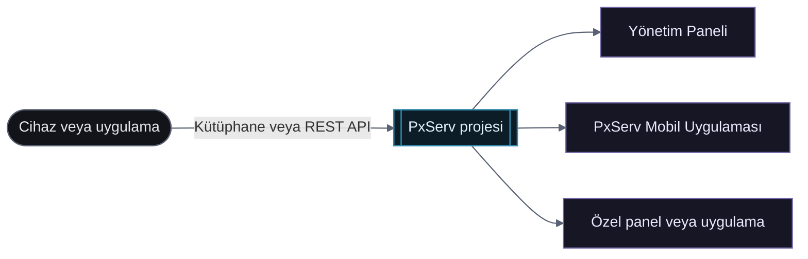

# Hızlı Başlangıç

PxServ, yazılım ve donanım projelerini buluta bağlamak için API ve kütüphane desteği sunan bir IoT platformudur. Arduino, JavaScript/TypeScript, Rust, ESP32, ESP8266, Raspberry Pi ve internete bağlanabilen her cihazla uyumludur.

## İlk veri akışınız

Arduino Kütüphanesi ile gönderilen sensör verisi; Yönetim Paneli, PxServ Mobil Uygulaması ve özel uygulamalardan kullanılabilir.

<div className="docs-mermaid">



</div>

## Adımlar

### 1. Proje Oluşturun

PxServ platformuna giriş yapın ve yeni bir proje oluşturun. Tüm isteklerde kimlik doğrulaması için kullanacağınız bir proje API anahtarı alacaksınız.

### 2. Entegrasyon Yönteminizi Seçin

PxServ şu entegrasyonları destekler:

* [Arduino Kütüphanesi](/tr/arduino-kutuphanesi/)
* [JavaScript / TypeScript Kütüphanesi](/tr/javascript-typescript-kutuphanesi/)
* [Rust Kütüphanesi](/tr/rust-kutuphanesi/)
* [REST API](/tr/rest-api/)
* [Gerçek Zamanlı Bağlantı (Socket.IO)](/tr/gercek-zamanli-baglanti/)
* [OTA Özelliği](/tr/ota-ozelligi/)

### 3. PxServ'e Veri Gönderin

Aşağıdaki örnek, DHT11 sensörü ve ESP32 kullanan Arduino Kütüphanesi ile sıcaklık ve nem verilerini PxServ'e göndermektedir:

```cpp
#include <PxServ.h>
#include "DHT.h"

#define DHT_PIN 4
#define DHT_TYPE DHT11

PxServ client("pxserv_api_anahtariniz");
DHT dht(DHT_PIN, DHT_TYPE);

void setup() {
  Serial.begin(115200);
  PxServ::connectWifi("wifi_ssid", "wifi_sifre");
  dht.begin();
}

void loop() {
  float temperature = dht.readTemperature();
  float humidity = dht.readHumidity();

  if (isnan(temperature) || isnan(humidity)) {
    Serial.println("DHT11 sensöründen veri okunamadı.");
    return;
  }

  client.setData("temperature", String(temperature));
  client.setData("humidity", String(humidity));
}
```

### 4. Verilerinizi Yönetin

Veri aktarımı başladıktan sonra şunları yapabilirsiniz:

* Yönetim panelinden yapay zeka destekli veri analizi yapın
* İstatistikler sayfasında geçmiş verileri görüntüleyin
* Veritabanı sayfasından kayıtları inceleyin ve yönetin

<div className="docs-image-grid">


</div>

### 5. Verilerinize Her Yerden Erişin

Cihaz veya yazılım verilerinize şu yollarla erişebilirsiniz:

* PxServ Yönetim Paneli
* [PxServ Mobil Uygulaması](https://play.google.com/store/apps/details?id=net.pxserv.mobile)
* PxServ API ile geliştirilmiş özel paneller veya uygulamalar
