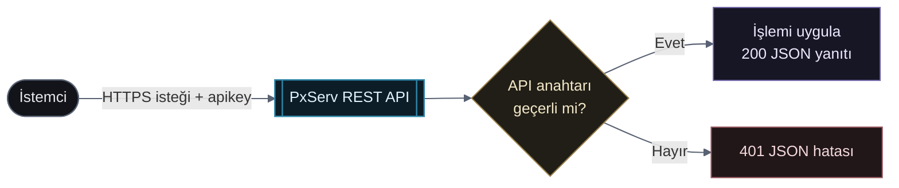

# REST API

PxServ verilerinizi HTTP üzerinden yönetmek için aşağıdaki servisi seçin.

  <a className="api-service-card" href="/tr/rest-api/veritabani/">
    DB
    <strong>Veritabanı API’si</strong><small>Veri kaydetme, okuma, değiştirme ve kaldırma işlemleri</small>
    <b>→</b>
  </a>

## İstek yaşam döngüsü

Her istek proje API anahtarıyla doğrulanır ve tutarlı bir JSON yanıtı döndürür.

